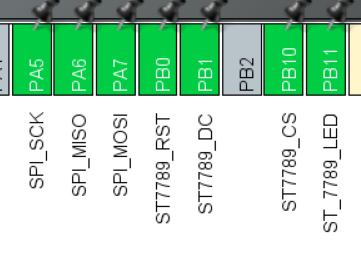

# ST7789的HAL库驱动

## 屏幕规格： **320 × 240** 
### 示例芯片：STM32F103C8T6
   **引脚配置**
  > 

### 网上很多ST7789的驱动，但是苦于一直找不到适配这个屏幕规格的HAL驱动，而且商家(鸿讯电子LCD)给的驱动是基于标准库的，甚至有很多是直接操作寄存器的，如果直接添加到HAL库工程里使用，用两套不同的API，和不同的操作层，感觉不太舒服，肯定也是不太安全的，所以我根据商家给的驱动移植到了HAL库，用HAL库的API实现了原本一些标准库和寄存器的操作

## 源码：[src目录](src)
        src
        ├── FONT.H 字库文件，跟原版驱动一样
        ├── LCD.c HAL库LCD驱动，函数具体实现
        ├── LCD.h HAL库头文件，宏定义和api引出
        ├── pic.h 存放图片数组的文件，跟原版驱动一样
        └── 标准库原版
                ├── FONT.H ...
                ├── LCD.c 标准库LCD驱动...
                ├── LCD.h 标准库头文件...
                └── pic.h ...

## 测试用例 [main目录](main)
**main.c 文件展示了HAL库里面如何调用LCD的API，均测试通过**

## ? *"你不需要变成飞鸟或者游鱼，只要你努力地生活，你所珍视的一切都会是你幸福的源泉。"* ― 纳西妲